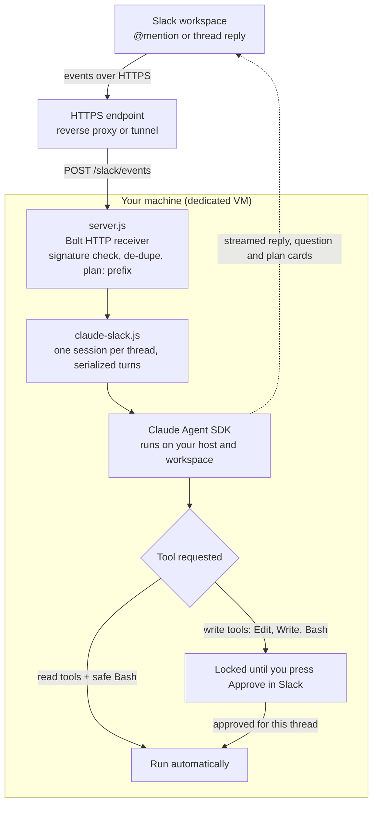

# slack-claude-agent

Self-hosted Slack bot that lets you @mention Claude in any thread and get streaming replies, interactive question cards, and plan approval gating before it can touch your files. One Claude Agent SDK session per thread, running entirely on your own machine and workspace, with no third-party service in the middle.

Think of it as a simple, solo, self-hosted take on the idea behind [Claude in Slack](https://www.anthropic.com/news/introducing-claude-tag). You bring your own machine, your own Anthropic credentials, and one project directory. The bot does the rest.

## What it does

* You @mention the bot in a channel. It opens a Claude session for that thread and streams the reply back into a single live-updating Slack message.
* Follow-up replies in the same thread continue the conversation with no re-mention needed. Each thread keeps its own Claude session, and sessions survive restarts.
* When Claude needs a decision, its questions render as native Slack radio or checkbox cards. Your selection resumes the thread.
* When Claude wants to change files, it must present a plan first. Write tools stay locked until you press **Approve** in Slack. You can also press **Request changes** to send feedback.
* Prefix a message with `plan:` to explicitly ask for a plan before any action.

## What it does NOT do

* It does not run in Anthropic's cloud. It runs on your host, against one directory you choose.
* It does not post Claude's internal tool calls (Read, Bash, Edit, and so on) into Slack. Those are tracked internally for permission gating but never surfaced.
* It does not use Socket Mode. It listens over plain HTTP and expects an HTTPS endpoint (a reverse proxy or tunnel) in front of it.

## Requirements

Please read the [Security model](#security-model) before installing. This tool gives Claude real filesystem and shell access to a directory on the host, driven by Slack messages.

* **A dedicated VM (or at minimum a container).** This is a requirement, not a nice-to-have. The agent can run shell commands, so give it its own low-privilege sandbox rather than a box that holds production credentials, SSH keys, or other projects.
* **Node.js 18 or newer.**
* **Claude Agent SDK authentication.** Either a logged-in `claude` CLI on the host, or an `ANTHROPIC_API_KEY` in the process environment. The SDK spawns Claude as the user running this server, so that user must be authenticated.
* **A Slack workspace** where you can create and install an app.
* **A public HTTPS endpoint** that forwards to this server's port. Any reverse proxy or tunnel works: [nginx](https://nginx.org/), [Traefik](https://traefik.io/), [Caddy](https://caddyserver.com/), [cloudflared](https://developers.cloudflare.com/cloudflare-one/connections/connect-networks/), or [ngrok](https://ngrok.com/). Cloudflare is optional; the examples below just use `cloudflared` because it is quick to start. See [Set up a Cloudflare tunnel](#set-up-a-cloudflare-tunnel).

## Quick start

1. **Clone and install.**
   ```
   git clone https://github.com/acip/slack-claude-agent.git
   cd slack-claude-agent
   npm install
   ```
2. **Expose the port over HTTPS.** Put a public HTTPS endpoint in front of the port you plan to use (default 3999) and copy its URL. Use whichever reverse proxy or tunnel you prefer (see Requirements). Quick throwaway tunnel with cloudflared:
   ```
   cloudflared tunnel --url http://localhost:3999
   ```
   For a stable hostname, see [Set up a Cloudflare tunnel](#set-up-a-cloudflare-tunnel).
3. **Create the Slack app.** Go to [api.slack.com/apps](https://api.slack.com/apps), choose **Create New App**, then **From a manifest**, and paste [`slack-app-manifest.yaml`](slack-app-manifest.yaml). Replace `your-tunnel-host.example.com` in it with your tunnel hostname first. The manifest requests private-channel scopes (`groups:history`, `message.groups`) too; remove them if you only need public channels.
4. **Set both request URLs** to `https://<your-tunnel-host>/slack/events`. It goes in two places: **Event Subscriptions** and **Interactivity & Shortcuts**. People miss the Interactivity one, and then buttons do nothing.
5. **Install the app** to your workspace and copy the **Bot User OAuth Token** (`xoxb-...`) and the **Signing Secret**.
6. **Configure the environment.**
   ```
   cp .env.example .env
   ```
   Fill in `SLACK_BOT_TOKEN`, `SLACK_SIGNING_SECRET`, `PORT`, and `PROJECT_WORKSPACE`.
7. **Customize the persona (optional).**
   ```
   cp prompt.example.md prompt.md
   ```
   Edit `prompt.md`. It is gitignored, so your version stays private.
8. **Start the server.**
   ```
   npm start
   ```
9. **Invite and mention the bot.** In Slack, run `/invite @claude` in a channel, then mention it: `@claude what does this project do?`

### Set up a Cloudflare tunnel

Cloudflare is optional (any reverse proxy or tunnel works), but `cloudflared` is a quick way to get a public HTTPS URL. Install it from [Cloudflare's downloads](https://developers.cloudflare.com/cloudflare-one/connections/connect-networks/downloads/) (`brew install cloudflared`, `apt install cloudflared`, or a direct binary).

**Quick, throwaway tunnel** (random `*.trycloudflare.com` URL, no account needed, good for testing):
```
cloudflared tunnel --url http://localhost:3999
```
It prints an HTTPS URL. That URL changes every run, so you would re-paste it into Slack each time.

**Named, persistent tunnel** (stable hostname on a domain in your Cloudflare account, best for production):
```
# 1. Authenticate (opens a browser; pick the domain to use)
cloudflared tunnel login

# 2. Create a tunnel and its credentials file
cloudflared tunnel create slack-claude-agent

# 3. Point a hostname at it (creates the DNS record for you)
cloudflared tunnel route dns slack-claude-agent slack-bot.yourdomain.com

# 4. Run it, forwarding to the local port
cloudflared tunnel run --url http://localhost:3999 slack-claude-agent
```
Your stable Slack request URL is then `https://slack-bot.yourdomain.com/slack/events`. To keep it running, install it as a service with `cloudflared service install` (see Cloudflare's docs), or manage it under pm2 alongside the app.

## Configuration

All configuration is through environment variables (loaded from `.env`).

| Variable | Required | Default | Purpose |
|---|---|---|---|
| `SLACK_BOT_TOKEN` | yes | none | Bot User OAuth token (`xoxb-...`). |
| `SLACK_SIGNING_SECRET` | yes | none | Verifies that requests really come from Slack. |
| `PORT` | no | 3000 | HTTP port the server listens on. The `.env.example` uses 3999. |
| `PROJECT_WORKSPACE` | yes | current dir | Absolute path to the one directory the agent may read and write. `CLAUDE_WORKSPACE` also works and takes precedence. |
| `CLAUDE_MODEL` | no | `claude-sonnet-5` | Model id. `claude-opus-4-8` is the higher-quality upgrade. |
| `AGENT_PROMPT_FILE` | no | `./prompt.md` | Path to a custom system prompt file. Falls back to a built-in default if missing. |
| `CLAUDE_SETTING_SOURCES` | no | `project,local` | Which Claude settings layers the agent inherits. Add `user` to also inherit your global `~/.claude` config. See Security. |
| `ALLOW_MCP_TOOLS` | no | off | Allow MCP tools (`mcp__*`) to run. Off by default (the gate blocks them). See Tips and tricks. |

Note: this app uses HTTP plus your signing secret. It does not use Socket Mode, so there is no `SLACK_APP_TOKEN` here by design.

## Customizing the system prompt

The bot appends a system prompt on top of the Claude Code preset. To change its persona or house rules, copy `prompt.example.md` to `prompt.md` and edit it. If neither `prompt.md` nor a file at `AGENT_PROMPT_FILE` exists, a built-in default is used and a warning is logged at boot. The prompt is read once at startup, so restart the server (or `pm2 restart slack-claude-agent`) after editing.

## Tips and tricks

### Add MCP servers (Notion, Google Drive, GitHub, and more)

The bot runs on the Claude Agent SDK, so it can use [MCP](https://modelcontextprotocol.io/) servers to reach tools like Notion, Google Drive, GitHub, or your own. There are two parts: telling the SDK about the server, and letting this app's permission gate run the tool.

**1. Declare the server.** The SDK loads MCP servers from your Claude settings according to `CLAUDE_SETTING_SOURCES` (see Configuration). Two common options:

* Per project: create a `.mcp.json` file in your `PROJECT_WORKSPACE` directory. Because the default `CLAUDE_SETTING_SOURCES` includes `project`, it is picked up automatically. `${VAR}` expands environment variables at load time.
  ```json
  {
    "mcpServers": {
      "notion": {
        "type": "http",
        "url": "https://mcp.notion.com/mcp",
        "headers": { "Authorization": "Bearer ${NOTION_TOKEN}" }
      },
      "filesystem": {
        "command": "npx",
        "args": ["-y", "@modelcontextprotocol/server-filesystem", "/data"]
      }
    }
  }
  ```
* Global: configure the server in your own `~/.claude` config, then set `CLAUDE_SETTING_SOURCES=user,project,local` so the bot inherits it. Note the Security caveat about the `user` layer before doing this.

**2. Allow the tools.** MCP tools are named `mcp__<server>__<tool>`, and this app's permission gate blocks unknown tools by default, so MCP tools stay denied until you opt in. Set `ALLOW_MCP_TOOLS=true` in `.env` and restart.

**Trust caveat.** When `ALLOW_MCP_TOOLS` is on, MCP tools run automatically and are **not** behind the plan-approval write gate. An MCP server can read and write in whatever it connects to. Only connect servers you trust, and scope their tokens as narrowly as the task needs (read-only where possible).

The details live in the Claude Agent SDK docs: [MCP in the Agent SDK](https://code.claude.com/docs/en/agent-sdk/mcp) and the [TypeScript SDK reference](https://code.claude.com/docs/en/agent-sdk/typescript) (`mcpServers`, `settingSources`, permissions).

### Change the model

Set `CLAUDE_MODEL` in `.env`. `claude-opus-4-8` is the highest quality, `claude-sonnet-5` (the default) is the cost and speed balance.

## Usage

| Action | How |
|---|---|
| Start a thread | `@claude <your question>` in a channel the bot is in. |
| Continue a thread | Just reply in the thread. No re-mention needed. |
| Ask for a plan first | Prefix with `plan:`, for example `plan: refactor the auth module`. |
| Approve changes | Press **Approve & proceed** on the plan card. This unlocks writes for that thread. |
| Send feedback on a plan | Press **Request changes** and type what should change. |
| Answer a question | Pick options on the card and press **Submit**. |

## Running in production

Use a process manager and a persistent HTTPS endpoint.

```
pm2 start ecosystem.config.js
pm2 logs slack-claude-agent
pm2 restart slack-claude-agent
```

Run your reverse proxy or tunnel (nginx, Traefik, Caddy, cloudflared, ngrok, whichever you chose) as a managed service rather than an ad hoc terminal command, so the public URL stays stable. If the hostname changes, update both Slack request URLs.

## Security model

This tool runs the Claude Agent SDK on your host with real filesystem and shell access to the workspace directory you configure, driven by Slack messages. **Anyone who can post in a channel the bot is in can task an autonomous agent on your machine.** There is no per-user authorization. Channel membership is the access control.

How the permission gate actually works, straight from the code:

* Read tools (Read, Glob, Grep, WebSearch, WebFetch, TodoWrite) run automatically and unattended.
* A small allowlist of read-only Bash commands (things like `find`, `ls`, `cat`, `grep`, `git log`, `curl`) also runs automatically. Treat this as a convenience heuristic, not a security boundary. Commands like `cat` and `curl` can read or send arbitrary data, and prefix based allowlisting is a known soft spot. It lowers friction. It does not make Bash safe.
* Write tools (Edit, MultiEdit, Write, NotebookEdit, and full Bash) are locked per thread until you approve a plan. Approval unlocks writes for that one thread only.
* Approval is coarse. Approving a plan unlocks all write tools for the rest of that thread. It is not a per-command confirmation. Review plans before approving. This is also your main defense against prompt injection from files the read tools ingest automatically.

Other things worth knowing:

* **Slack authenticity.** Inbound events are verified by the Slack Bolt library using your `SLACK_SIGNING_SECRET`. Unsigned or unexpected requests get a 404. The 404 is noise reduction, not authentication, so the port must be reachable only through your intended HTTPS endpoint.
* **Never enable bypassPermissions.** Setting the SDK permission mode to `bypassPermissions` collapses the whole gate and lets writes run with no approval. The shipped code never enables it. Do not add it.
* **Settings inheritance.** The shipped default reads Claude settings, project `CLAUDE.md`, and MCP config from the `project` and `local` layers only. It deliberately skips your personal global `~/.claude` config. If you widen `settingSources` in `claude-slack.js` to include `user`, the agent will also inherit your global `CLAUDE.md` and any MCP credentials it references. Review before doing that.

Operator checklist:

* Run it inside a dedicated VM (or at least a container), as a low-privilege user, scoped to one project directory. Not as root, and not on a box holding production credentials or SSH keys the agent should never see.
* Restrict channel membership. Being in the channel equals the ability to run the agent.
* There is no built-in rate limiting. Exposure is bounded only by who is in the channel.
* API usage bills to your Anthropic credentials. A busy or hostile channel is a cost vector.
* If your `.env` is ever exposed, rotate the Slack tokens immediately.

## Troubleshooting

| Symptom | Likely cause |
|---|---|
| Bot stays silent | It is not in the channel, or the `message.channels` event and `channels:history` scope are missing. |
| `url_verification` fails in Slack | Wrong `SLACK_SIGNING_SECRET`, or the tunnel is down. |
| Requests 404 | The request URL must end in `/slack/events`. |
| Buttons and cards do nothing | Interactivity request URL is not set. Set it to the same `/slack/events` URL. |
| Thread stops continuing after a restart | The thread is not in `thread_session_map.json`. Mention the bot again to start fresh. |

## How it works



`server.js` handles Slack wiring: mentions, thread replies, de-duplication of Slack's retries, and the `plan:` prefix. `claude-slack.js` is the bridge: it runs one Claude session per thread, serializes turns, gates tools, renders question and plan cards, and persists the thread-to-session map to `thread_session_map.json`.

## License

MIT. See [LICENSE](LICENSE).

## Contributing

Issues and pull requests are welcome. This is a small project meant to stay small and legible, so please keep changes focused and explain the trust or security impact of anything that touches the permission gate.
